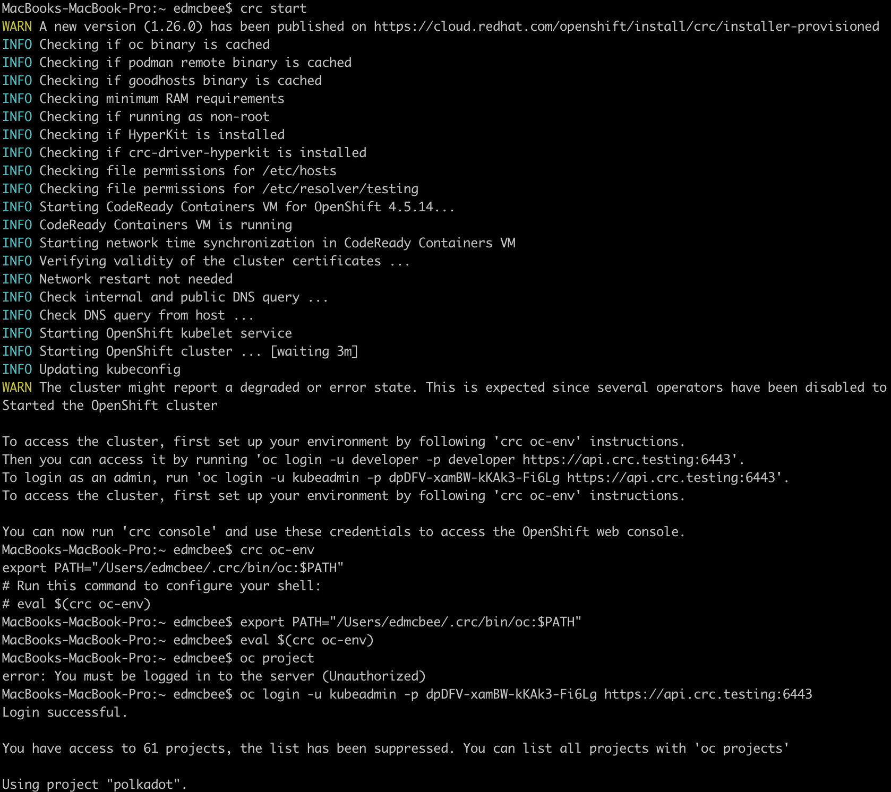
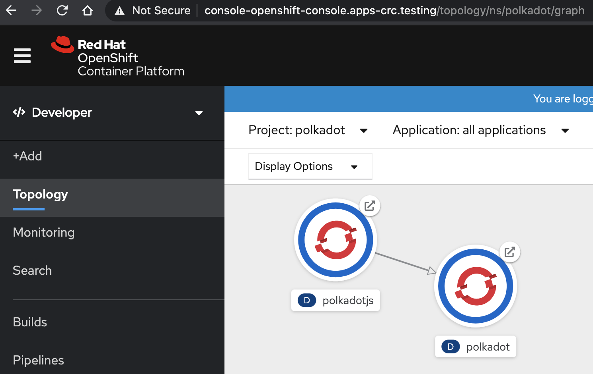

# P0: Deploy2K8 Test Relay Chain + UI + CICD

This is our initial attempt to deploy a Polkadot Blockchain to a local Kubernetes Cluster in a Pod.

The intent here is to showcase that a Polkadot Image, in this case, the container found in the public Dockerhub registry as pointed to from the official ParityTech Polkadot github repository can be deployed to a Kubernetes platform using a stateless Deployment manifest. In addition, deploy a corresponding UI such as the Polkadot-JS in a container.

  ### Requirements
  1. A Linux Deployment Machine. 
    Machine Specifications: 
      * 4 Core, 16GB RAM, with large free storage space
      * Docker, Git
  2. A Kubernetes platform. Local or on-prem Datacenter or on-cloud VPC
    Machine Specifications: 
      * 4-8 Core, 16-64GbRAM, with large free storage space
      * Minikube or CRC with Openshift 4.x or OKD 4.x or Openshift 4.x
      * Able to login to a Kubernetes platform via Kubectl or oc CLI.

           

      * And able to view the Openshift dashboard.

            

  ### Steps
  1. Develop the Deployment Manifest for the Polkadot image. The manifest specs, saved as deployment.yaml

```yaml  
apiVersion: apps/v1
kind: Deployment
metadata:
  name: polkadot
spec:
  selector:
    matchLabels:
      app: polkadot
  replicas: 1
  template:
    metadata:
      labels:
        app: polkadot
    spec:
      containers:
      - name: polkadot
        image: parity/polkadot:latest
        args: ["--name", "polkadot-test","--chain","westend","--ws-external","--rpc-external", "--rpc-cors", "all"]
        ports:
        - containerPort: 9944
          name: wss
        - containerPort: 9933
        - containerPort: 30333
        volumes:
        - name: polkadot
        mountPath: /polkadot
    volumeMounts:
      name: polkadot
      persistentVolumeClaim:
        claimName: polkadot-pvc
      spec:
      accessModes: [ "ReadWriteOnce" ]
      volumeMode: Filesystem
      resources:
        requests:
          storage: 1Gi        
```
  
  2. Deploy the deployment manifest to kubernetes by calling the below oc or kubectl CLI commands. But prior, call the security-context-constraint system to bypass the RBAC mechanism of kubernetes and openshift. This is a one-time call, to go around the major security obstacle that many inexperienced openshift operator will experience. Once this is overcomed, all else will be as per instruction documentation, easy. Call the oc apply to execute the above deployment manifest. Get pods to verify the status is "Running". To see the logs, invoke oc logs for either the pod or the deployment. Specifying the pod however requires the entire pod signature, but to specify the deployment, simply know the deployment name, and call it like below. 

```bash
oc adm policy add-scc-to-group anyuid system:authenticated
oc apply -f blockchain/deployment.yaml
oc get pods
oc logs deploy/polkadot 
```

  3. In order to expose a service handle to the deployed polkadot pod, we must specify a service manifest and then apply it.

```yaml
apiVersion: v1
kind: Service
metadata:
  name: polkadot-wss
spec:
  selector:
    app: polkadot
  ports:
    - name: wss
      protocol: TCP
      port: 9944
      targetPort: wss
```
    Implement by calling,
```bash
oc apply -f blockchain/service.yaml
```

  4. Finally, provide a route, so that the service can be given with a name, similar to setting-up the DNS entry for the service.
```yaml
apiVersion: route.openshift.io/v1
kind: Route
metadata:
  name: polkadot-wss
spec:
  to:
    kind: Service
    name: polkadot-wss
  port:
    targetPort: wss
```
    Then implement this by calling, ` oc apply -f blockchain/route.yaml ` 

  5.    